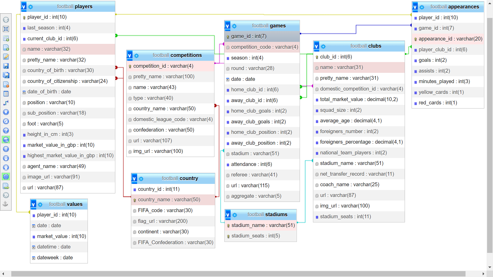

# Bài tập lớn Cơ sở dữ liệu

<h2>
Mã môn học
</h2>
<h3>INT2211 24</h3>
<h2>
Giảng viên
</h2>
TS. Lê Hồng Hải  
CN. Lê Thị Phương
<h2>
Thành viên thực hiện
<h3>
Nhóm FIO
</h3>
</h2>
Nguyễn Quang Anh - 21020116
 
Phạm Minh Vương - 21020425
 
Nguyễn Viết Tú - 21020092
<h2>
Football Manager
</h2>

<h2>
Chức năng của Website
</h2>
1. Tìm kiếm cầu thủ, câu lạc bộ, giải đấu  
2. Cung cấp thông tin chung về các cầu thủ đắt giá nhất (tổng hợp chung và theo riêng theo từng vị trí)  
3. Cung cấp thông tin chung về các câu lạc bộ giá trị nhất  
4. Cung cấp thông tin về các giải đấu: gồm bảng xếp hạng và danh sách vua phá lưới  
5. Cung cấp thông tin cụ thể về từng cầu thủ, sự nghiệp câu lạc bộ và thông số của cầu thủ trong màu áo câu lạc bộ đó  
6. Cung cấp thông tin cụ thể về từng câu lạc bộ và danh sách cầu thủ thuộc câu lạc bộ đó  
<h2>
Thiết kế Cơ sở dữ liệu
</h2>

1. Bảng <b>players</b> lưu trữ thông tin các cầu thủ  
2. Bảng <b>values</b> lưu trữ giá trị của các cầu thủ theo từng giai đoạn  
3. Bảng <b>competitions</b> lưu trữ thông tin các giải đấu bóng đá hàng đầu châu Âu  
4. Bảng <b>country</b> lưu trữ thông tin các quốc gia thuộc liên đoàn bóng đá FIFA  
5. Bảng <b>games</b> lưu trữ thông số, thống kê của các trận đấu  
6. Bảng <b>clubs</b> lưu trữ thông tin các câu lạc bộ bóng đá  
7. Bảng <b>stadiums</b> lưu trữ thông tin các sân vận động  
8. Bảng <b>appearances</b> lưu trữ số liệu của mỗi cầu thủ trong từng trận đấu
<h2>
Thiết kế Website
</h2>
Sử dụng các ngôn ngữ html, css, framework bootstrap cho thiết kế giao diện 
Sử dụng ngôn ngữ truy vấn mysql với phpMyAdmin cho database 
Sử dụng php để liên kết website với database, xử lý và đẩy dữ liệu lên website 
Link Website Demo: <a href="https://fioteam.000webhostapp.com/index.php">https://fioteam.000webhostapp.com/index.php</a>
